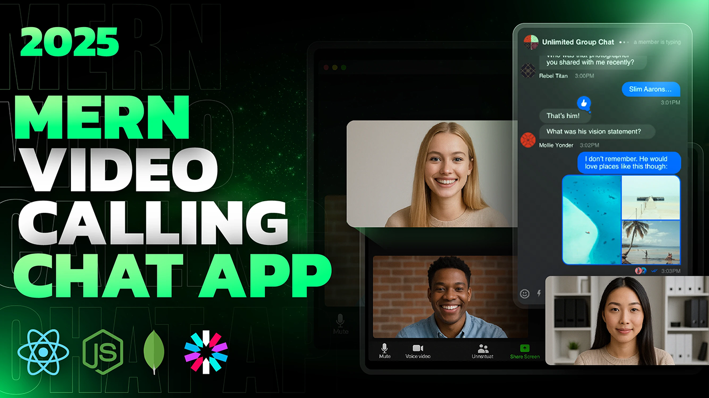

<div align="center">
	<h1>✨ Chatify ✨</h1>
	<p><strong>Real‑time chat & video calling web app with onboarding, friend system, and theming</strong></p>
	
	<br/>
	<br/>
	<p>
		<a href="https://chatify.pragyesh.tech" target="_blank">Live Demo</a> ·
		<a href="#-features">Features</a> ·
		<a href="#-quick-start">Quick Start</a> ·
		<a href="#-environment-variables">Env Vars</a> ·
		<a href="#-api-endpoints">API</a> ·
		<a href="#-architecture">Architecture</a> ·
		<a href="#-roadmap">Roadmap</a>
	</p>
</div>

---

## 🚀 Overview
Chatify is a full‑stack MERN application that lets authenticated users:
1. Sign up / log in (JWT HttpOnly cookie auth + Google OAuth)
2. Complete onboarding (profile, languages, bio, location)
3. Search for users by username & send friend requests
4. Accept requests and manage a friends list
5. Start 1:1 real‑time chats (Socket.io)
6. Launch instant WebRTC video calls directly from a chat
7. Persist user state & relationships in Appwrite
8. Enjoy theme customization (Zustand + DaisyUI/Tailwind)

Backend is deployed on Railway and frontend served via Vercel with custom domain. Socket.io powers real-time messaging and WebRTC enables peer-to-peer video calls.

## 🧩 Tech Stack
Frontend:
- React 19 + Vite 7
- Tailwind CSS 4 + DaisyUI component themes
- React Router v7
- TanStack Query (server state & caching)
- Zustand (lightweight client state)
- Socket.io Client (real-time messaging)
- WebRTC (peer-to-peer video calls)
- Axios (API layer) & react-hot-toast (UX feedback)
- Vite PWA (Progressive Web App support)

Backend:
- Node.js (ESM) + Express 5
- Appwrite (Database, Collections & Authentication)
- JWT (jsonwebtoken) for auth (HttpOnly cookie)
- bcryptjs for password hashing
- Socket.io (real-time messaging & signaling)
- Passport.js (Google OAuth 2.0)
- Cloudinary (image uploads)
- Resend (email service)
- CORS, cookie-parser, dotenv, express-session

Dev/Deployment:
- Vercel (frontend), Railway (backend)
- Nodemon for backend dev

## ✨ Features
- Secure authentication (signup/login/logout) with validation
- Google OAuth 2.0 integration for quick sign-in
- Email verification system with Resend
- Password reset & change functionality
- Onboarding flow gating access to core app until profile completion
- Random avatar assignment on signup
- Profile picture upload with Cloudinary
- Friend system (search users by username, send & accept requests, list friends)
- Real‑time chat with Socket.io (1:1 channels, typing indicators, online status)
- WebRTC-based peer-to-peer video calling with camera/mic controls
- Theming & persistence via localStorage (20+ DaisyUI themes)
- Robust Axios instance with request/response interceptors & error logging
- Production‑aware CORS & cookie settings (SameSite, secure flags)
- Health check endpoint `/api/health`
- Progressive Web App (PWA) support
- Mobile-responsive design with bottom navigation

## 🗂 Folder Structure (Top Level)
```
chatify/
	backend/
		src/
			controllers/      # Route handlers
			lib/              # Appwrite, Socket.io, Cloudinary helpers
			middleware/       # Auth guards & file upload
			routes/           # Express routers
			services/         # Business logic layer
			server.js         # App entry
	frontend/
		src/
			components/       # Reusable UI components
			pages/            # Route-level screens
			hooks/            # React Query + custom hooks
			lib/              # API & axios abstraction
			store/            # Zustand store(s)
			context/          # Socket context
			constants/        # Language/theme constants
```

## 🔐 Authentication Flow
1. User signs up → password hashed (bcryptjs) → JWT cookie set (7d) → email verification sent
2. Google OAuth → creates/links account → auto-verified → JWT cookie set
3. Protected routes use `protectRoute` middleware → reads `jwt` cookie → verifies & attaches `req.user`
4. `GET /api/auth/me` returns current sanitized user (excludes password) + token for Socket.io auth

## 👥 Friend Request Lifecycle
1. `POST /api/users/friend-request/:id` creates a pending request (duplicate/self checks in Appwrite)
2. Recipient fetches pending via `GET /api/users/friend-requests`
3. `PUT /api/users/friend-request/:id/accept` marks accepted & updates both users' friend arrays
4. Friends listed via `GET /api/users/friends`

## 💬 Chat & 📹 Video
- Real-time messaging: Socket.io with channel-based rooms (channelId = sorted user IDs)
- Messages stored in Appwrite messages collection
- Typing indicators and online status via Socket.io events
- Video call: WebRTC peer-to-peer connection with Socket.io for signaling
- Call controls: mute/unmute, video on/off, end call
- STUN servers for NAT traversal

## ⚙️ Environment Variables
Create `backend/.env`:
```env
PORT=5000
JWT_SECRET_KEY=your_jwt_secret_key
SESSION_SECRET=your_session_secret

# Frontend URL
FRONTEND_URL=http://localhost:5173

# Cloudinary Configuration
CLOUDINARY_CLOUD_NAME=your_cloud_name
CLOUDINARY_API_KEY=your_api_key
CLOUDINARY_API_SECRET=your_api_secret

# Google OAuth Configuration
GOOGLE_CLIENT_ID=your_google_client_id
GOOGLE_CLIENT_SECRET=your_google_client_secret
GOOGLE_CALLBACK_URL=http://localhost:5000/api/auth/google/callback

# Resend Email Service
RESEND_API_KEY=your_resend_api_key

# Appwrite Configuration
APPWRITE_ENDPOINT=https://cloud.appwrite.io/v1
APPWRITE_PROJECT_ID=your_project_id
APPWRITE_API_KEY=your_api_key
APPWRITE_DATABASE_ID=your_database_id
APPWRITE_USERS_COLLECTION_ID=your_users_collection_id
APPWRITE_FRIEND_REQUESTS_COLLECTION_ID=your_friend_requests_collection_id
APPWRITE_MESSAGES_COLLECTION_ID=your_messages_collection_id
APPWRITE_CHANNELS_COLLECTION_ID=your_channels_collection_id
```

Frontend `vite` variables (create `frontend/.env`):
```env
VITE_API_URL=http://localhost:5000
```

Optional (deployment):
```env
NODE_ENV=production
FRONTEND_URL=https://your-domain.com
```

Notes:
- Ensure production domain is whitelisted in CORS settings
- Use secure, randomly generated secrets for JWT and session

## 🏁 Quick Start
Clone & install:
```bash
git clone https://github.com/pragyesh7753/Chatify.git
cd Chatify

# Backend
cd backend
npm install
cp .env.example .env  # Configure all environment variables

# Frontend
cd ../frontend
npm install
cp .env.example .env  # Add VITE_API_URL
```

Run dev servers (two terminals):
```bash
# Terminal 1
cd backend
npm run dev

# Terminal 2
cd frontend
npm run dev
```

Open: http://localhost:5173

## 🔌 API Endpoints (Summary)
Auth:
- POST `/api/auth/signup` - Create new account
- POST `/api/auth/login` - Login with credentials
- POST `/api/auth/logout` - Logout user
- GET  `/api/auth/me` - Get current user + token
- POST `/api/auth/onboarding` - Complete user profile
- GET  `/api/auth/verify-email/:token` - Verify email
- POST `/api/auth/resend-verification` - Resend verification email
- POST `/api/auth/forgot-password` - Request password reset
- POST `/api/auth/reset-password/:token` - Reset password
- POST `/api/auth/change-password` - Change password (authenticated)
- GET  `/api/auth/google` - Initiate Google OAuth
- GET  `/api/auth/google/callback` - Google OAuth callback

Users (protected):
- GET  `/api/users/search?username=<query>` - Search users by username
- GET  `/api/users/friends` - Get user's friends list
- POST `/api/users/friend-request/:id` - Send friend request
- PUT  `/api/users/friend-request/:id/accept` - Accept friend request
- GET  `/api/users/friend-requests` - Get incoming friend requests
- GET  `/api/users/outgoing-friend-requests` - Get outgoing friend requests
- GET  `/api/users/profile` - Get user profile
- PUT  `/api/users/profile` - Update user profile
- POST `/api/users/change-email` - Request email change
- GET  `/api/users/verify-email-change/:token` - Verify email change

Chat (protected):
- GET  `/api/chat/channels` - Get user's chat channels
- POST `/api/chat/channels` - Create or get channel
- GET  `/api/chat/messages/:channelId` - Get channel messages
- POST `/api/chat/messages` - Send message

Utility:
- GET `/api/health` - Health check endpoint
- GET `/api/oauth-check` - OAuth configuration status

## 🧪 Testing
Currently no automated tests. Suggested next steps:
- Unit: controllers (auth, user, chat)
- Integration: friend request lifecycle, real-time messaging
- E2E: Playwright/Cypress for onboarding + chat + video call flow

## 🛡 Security Considerations
- HttpOnly JWT cookie reduces XSS token theft
- Passwords hashed with bcryptjs (salt rounds = 10)
- CORS restricts origins; consider adding rate limiting & helmet
- Email verification prevents fake accounts
- Session-based Google OAuth with secure cookies
- File upload restrictions (size, type) for profile pictures
- Environment variables for sensitive credentials

## 🏗 Architecture
```
┌────────────┐   JWT Cookie   ┌────────────┐   WebRTC      ┌──────────────┐
│  Browser   │ ─────────────▶ │  Express    │  Signaling   │  Browser     │
│  (React)   │ ◀───────────── │  (Backend)  │ ────────────▶│  (Peer)      │
└─────┬──────┘                 └────┬───────┘               └──────────────┘
      │  REST /api/*                │                             
      │  Socket.io (real-time)      │ Appwrite                    
      ▼                             ▼                             
  UI State / Query          Collections (Users, Messages,        
  Socket Context            Channels, Friend Requests)            
```

## 📦 Deployment Notes
- Frontend build: `npm run build` (Vite) → deploy `dist/` to Vercel
- Backend: Deploy to Railway with `NODE_ENV=production`
- Ensure correct CORS origins for production domain
- Configure all environment variables on hosting platform
- Add health check endpoint for uptime monitoring (already present at `/api/health`)
- Socket.io requires WebSocket support from hosting provider

## 🛠 Troubleshooting
| Issue | Possible Cause | Fix |
|-------|----------------|-----|
| CORS error | Unlisted origin | Add domain to allowedOrigins in `server.js` |
| 401 Unauthorized | Missing/expired JWT | Re-login; check cookie blocked by browser | 
| Socket connection failed | CORS or WebSocket issue | Verify VITE_API_URL and Socket.io CORS config |
| Video call not connecting | STUN/TURN server issue | Check browser console for WebRTC errors |
| Chat not loading | Appwrite collection issue | Verify collection IDs and permissions |
| Email not sending | Resend API issue | Check API key and domain verification |

## 🗺 Roadmap / Ideas
- ✅ Password reset & email verification
- ✅ User presence & typing indicators
- ✅ WebRTC video calling
- ✅ Google OAuth integration
- ✅ PWA support
- 📋 Group channels & multi‑party calls
- 📋 Message search & attachments
- 📋 Screen sharing during video calls
- 📋 Message reactions & replies
- 📋 i18n for UI + language preferences
- 📋 Automated test suite & CI workflow
- 📋 Call recording feature

## 🤝 Contributing
1. Fork project & create feature branch
2. Keep commits atomic & descriptive
3. Open PR with context + before/after if UI changes
4. Follow existing code style and conventions

## 📄 License
Add an open source license (MIT recommended) in a `LICENSE` file.

## 🙌 Acknowledgements
- [Appwrite](https://appwrite.io/) - Backend as a Service
- [Socket.io](https://socket.io/) - Real-time communication
- Tailwind CSS + DaisyUI - UI framework
- TanStack React Query - Server state management
- WebRTC - Peer-to-peer video calling

## ✅ Status
Active development. Core 1:1 chat & WebRTC video calling functional. Production-ready with OAuth, email verification, and PWA support.

---
Made with ❤️ using the MERN stack, Socket.io & WebRTC.